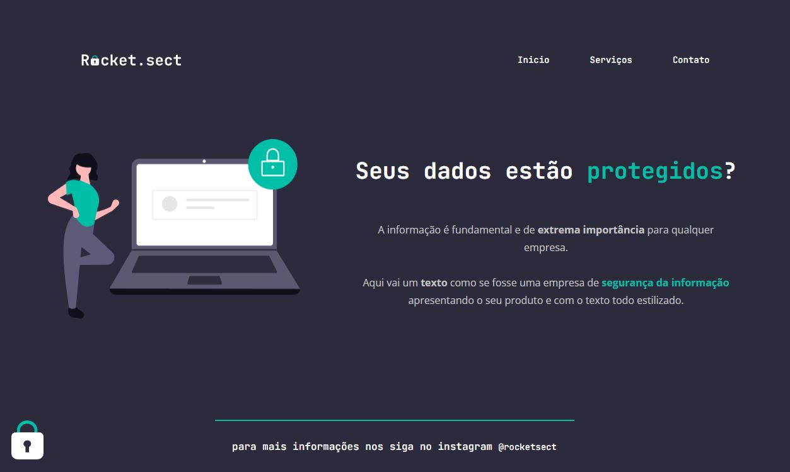

<h1 align="center">Treine.me  </h1>

 
 

  

 
    <a href="https://fernandoaugustodev.github.io/Rocket.sect/" target="_blank" >Veja o Projeto</a>

## 💻 Sobre o Projeto
 

  Neste desafio foi pedido para recriar uma aplicação, a partir de um layout com o Figma, para treinar o que aprendemos no stage 02 do explorer da Rocketseat.   
  Site totalmente estático usando somente HTML e CSS

 

## 🛠 Techs

Tecnologias usadas neste projeto

✅ HTML  
✅ CSS
   - Estruturação da página em HTML
   - Posição dos elementos na tela
   - Aplicação de fontes customizadas
   - Alinhamento de textos e elementos
---

## 👨🏼‍💻 Autor

Fernando Augusto 

 
  
 
© 2022 GitHub, Inc.
Terms Privacy Security Status Docs
